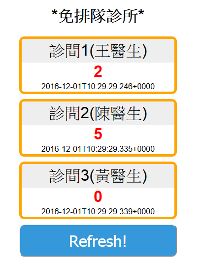

###startup command:###
```bash
mvn spring-boot:run
```

###demo url:###
```bash
http://127.0.0.1:8080
```


###h2 database default settings:###
```bash
Driver class = org.h2.Driver
JDBC URL = jdbc:h2:mem:testdb
User name = sa
Password = [blank]
web console url = /h2-console
```
